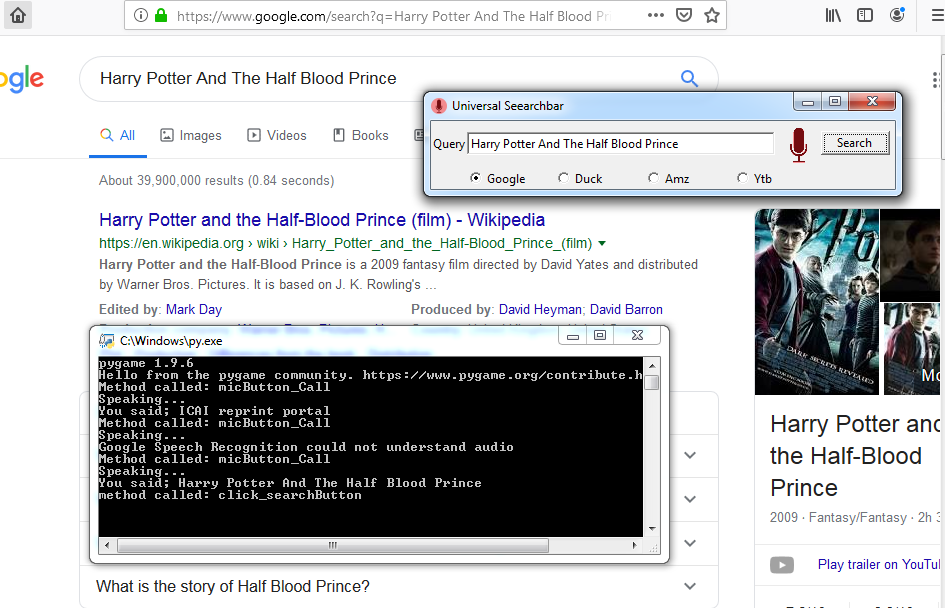
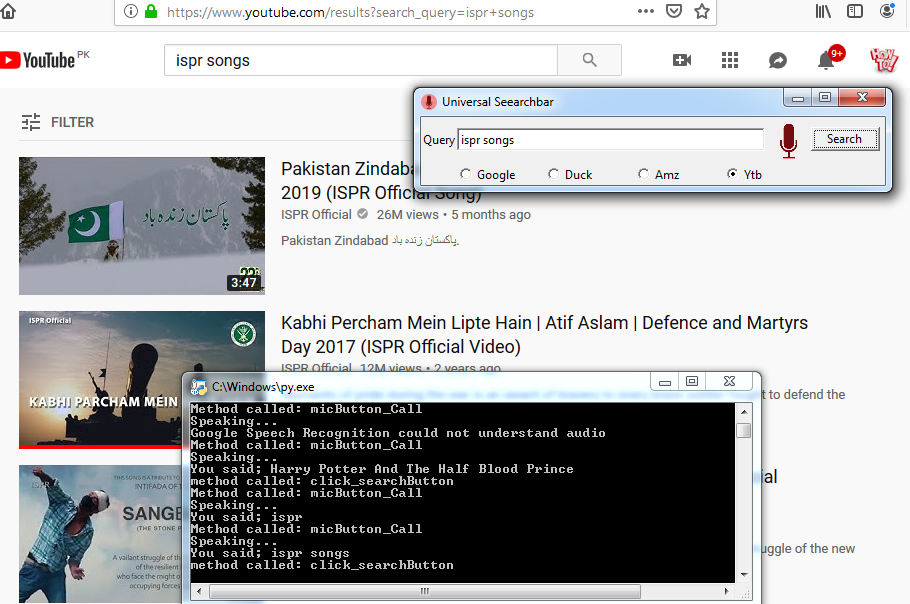

# speech_recogmition_python
Multi search bar having option of speech recognition for online search.
It has these options as follows:
1. Google
2. Yahoo
3. Youtube

## Required pip
1. tkinter   
2. webbrowser
3. pygame
4. pyaudio
5. speech_recognition

